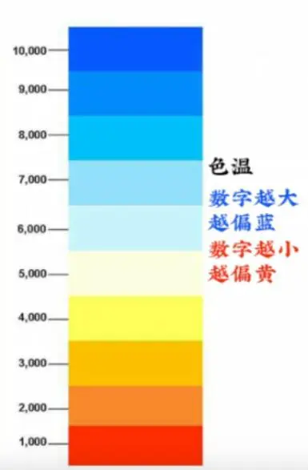

# 白平衡 WB

可以改变画面的色彩

影调是照片的基调，其实也就是我们常说的光影。影调是通过处理照片的明暗关系层级来塑造造型，表达情感，氛围渲染，所以调整影调就是处理照片的黑白灰之间的关系，其中主要的参数就是白平衡。

**光线也是有颜色的。假如我要拍摄一张白纸，但是在黄色灯光下会偏黄；在蓝色灯光下会偏蓝。这时候相机就会用白平衡调整色差，确保白纸拍出来就是白色的。**

白平衡一般有以下几种模式
- 自动
- 预设项 （白炽灯、日光、荧光灯、阴天）
- 自定义（可设置色温区间为2000-8000k）

白平衡的数值越小，画面越冷；数值越大，画面越冷

白平衡其实就是相机还原白色的能力，通过“白平衡”这项设置，能够确保拍摄时拍摄对象的色彩不受光源色彩色温影响，**就相当于一个彩色滤镜，能纠正光照环境造成色彩偏差，真实还原景物的颜色。**

- 在钨丝灯下拍照时画面会偏黄，在日光灯的房间里拍照画面会偏绿。这时候白平衡就发挥作用了，通过设置对应的白平衡模式，可以消除这种光源造成的偏差，使拍出来的照片更接近我们的视觉习惯。

所调节的数值其实就是色温。色温是一种温度衡量方法，通常用在物理和天文学领域，这种方法标定的色温与普通大众所认为的“暖”和“冷”正好相反。

色温在摄影中是相反的，在摄影中，K>6000时，称为暖调，主要用于拍摄古建、夕阳，美食可以让画面更暖

K越小时，称为冷调，主要用于拍摄蓝天，大海，可以让天更蓝。

- 在GB/T 9473-2017 《读写作业台灯性能要求》中指出夜晚使用的灯光色温不高于4000K。

## 色温的各种模式和适用范围

自动预设白平衡： 根据画面自动匹配合适滤镜，最为常用

白炽灯模式： 色调偏冷，用于拍摄科技感十足的画面

日光模式： 在有太阳时使用

荧光灯模式： 特定场景使用，基本用不到，或室内使用

阴天模式：色调偏暖，可用于花朵，夕阳等暖色调

自定义模式： 数值越小，画面越冷；数值越大，画面越暖。